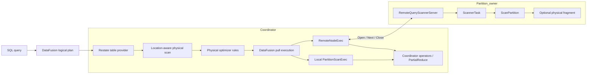
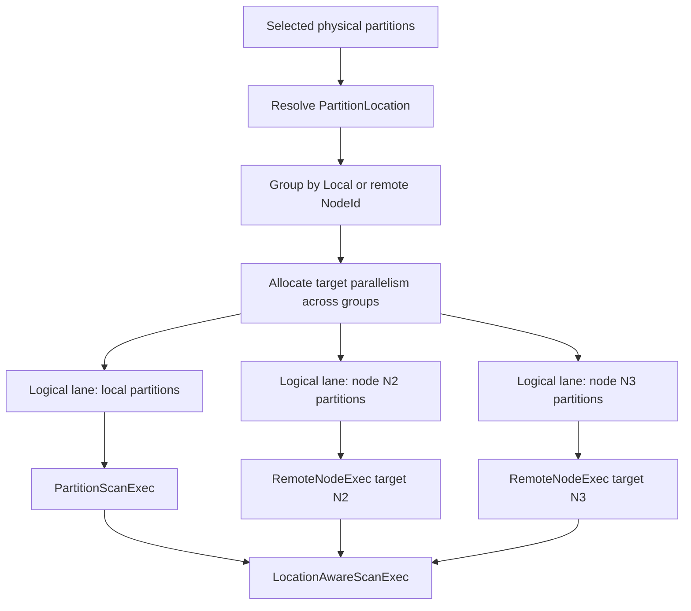
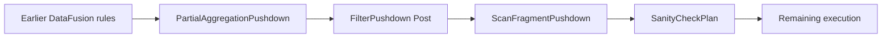
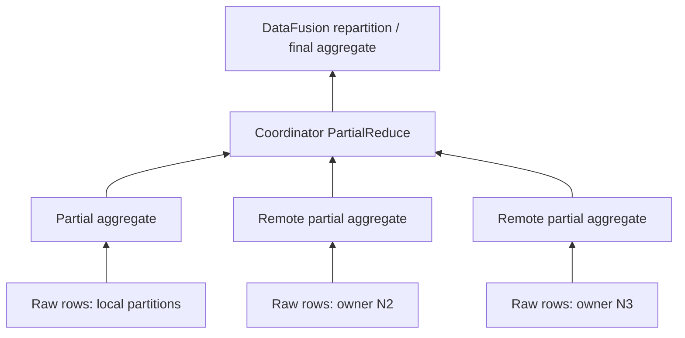
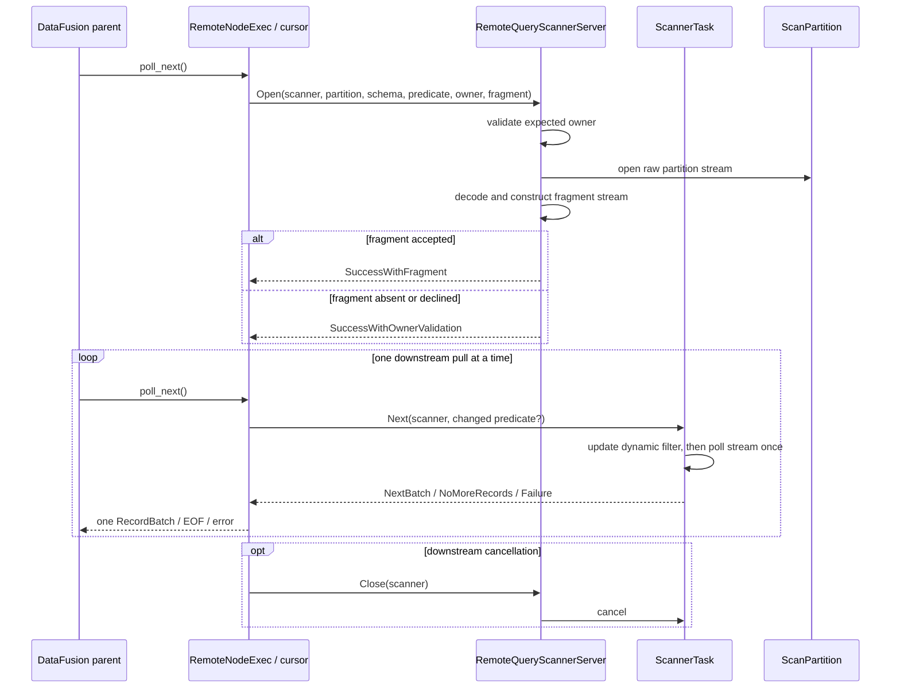
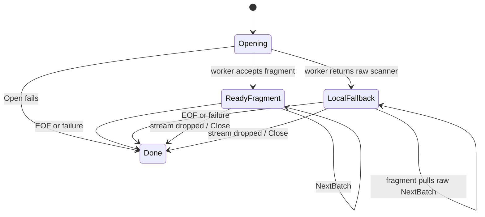

# Distributed storage-query execution architecture

This document describes the current storage-query execution architecture: how DataFusion
plans local and remote work, which operators can run at partition owners, how pull-based
remote cursors behave, and what crosses the network. For the design history and detailed
pushdown rationale, see [partial-aggregation-pushdown.md](partial-aggregation-pushdown.md).

## 1. System overview

Storage queries use DataFusion for SQL parsing, logical planning, physical planning,
optimization, and execution. Restate adds location-aware table providers, physical plan
nodes, optimizer rules, and a remote scanner service.

There are three scan families:

1. **Partition-routed tables** use `PartitionedTableProvider`. Every selected Restate
   partition is assigned to a local or remote physical-plan branch.
2. **Node-fan-out tables** use `NodeFanOutExecutionPlan`. They query a set of cluster
   nodes rather than routing by partition ID.
3. **Local generic tables** use `GenericExecutionPlan` and never enter the distributed
   partition protocol.

The fragment pushdown described below applies to partition-routed tables. Node-fan-out
tables reuse the raw remote scanner protocol but do not send an expected partition owner
or a physical fragment.

## 2. Planning partition-routed scans

### 2.1 Partition selection and placement

`PartitionedTableProvider::scan` performs these steps while building the physical plan:

1. Build the projected Arrow schema.
2. Convert DataFusion filters to physical expressions.
3. Extract partition-key constraints when possible.
4. Select physical Restate partitions and key ranges.
5. Resolve each partition to `PartitionLocation::Local` or
   `PartitionLocation::Remote(NodeId)`.
6. Group partitions by location and allocate DataFusion execution lanes.
7. Build one local or remote scan branch for each location.

The stateless grouping and lane allocation live in `partition_planning.rs`. A logical
DataFusion partition may contain multiple physical Restate partitions, but all of them
have the same location. Physical scans within one logical partition execute sequentially.

Every location receives at least one lane. If the query touches more locations than
DataFusion's `target_partitions`, location isolation takes priority and the physical plan
contains more lanes than that target.

### 2.2 Physical plan nodes

| Node | Current responsibility |
|---|---|
| `PartitionScanExec` | Local scan leaf for one location-isolated set of logical partitions. It owns projection, predicate, limit, metrics, and the distributed scanner adapter. |
| `RemoteNodeExec` | Opaque boundary for a fixed remote target. It privately owns a `PartitionScanExec` and an optional `RemoteFragment`. |
| `LocationAwareScanExec` | Combines multiple location branches through an internal `UnionExec` while retaining the table's single global statistics estimate. |
| `FragmentLeafExec` | Placeholder for the raw partition stream inside a serializable fragment template. It must be replaced before execution. |

`RemoteNodeExec::children()` is empty. This prevents ordinary DataFusion optimizer rules
from moving a locally implemented operator across the remote boundary. Restate optimizer
rules cross it only through `can_accept_fragment()` and `with_fragment()`.

An unmodified remote scan can advertise the ordering promised by its table scanner. Once
a fragment is attached, the remote node discards fragment-derived output ordering because
the worker binds the fragment to an unordered stream adapter. Other safe properties, such
as schema, partition count, equivalences, boundedness, and emission behavior, are retained.

### 2.3 Optimizer order

Restate installs its two fragment rules around DataFusion's final filter-pushdown pass:

`PartialAggregationPushdown` runs before the final filter pass so it can recognize the
partial-aggregate shape together with residual filters. `ScanFragmentPushdown` runs after
the final filter pass so mutable TopK filters have already reached the raw scans before
stable filters and projections are packaged into a fragment.

## 3. Remote fragments

### 3.1 Fragment contract

A `RemoteFragment` is an immutable, pre-encoded, single-input DataFusion physical-plan
template. It must have:

- exactly one `FragmentLeafExec` placeholder;
- no other leaf nodes;
- a unary path from the fragment root to that leaf;
- exactly one output partition;
- an input schema matching the raw scanner schema;
- an output schema matching the schema declared on the wire.

The generic fragment layer validates structure and serialization. Each optimizer rule is
responsible for proving that the operators it packages are semantically safe when run
independently at partition owners.

### 3.2 Current fragment-producing features

#### Stable filters and computed projections

`ScanFragmentPushdown` recognizes a maximal chain of `FilterExec` and `ProjectionExec`
operators immediately above a fragment-capable scan. It can ship ordinary filters,
computed projections, and a safe suffix beneath an ineligible outer operator.

The expression safety check rejects:

- volatile expressions;
- any expression with a non-zero dynamic generation;
- unresolved `UnKnownColumn` expressions;
- casts with non-default options that the DataFusion protobuf codec would not preserve.

A `FilterExec` with a fetch limit is not shipped because applying that limit independently
per physical partition changes global query semantics.

#### Partial aggregation

`PartialAggregationPushdown` ships a DataFusion `AggregateExec` in `Partial` mode, plus
eligible filters and projections below it, to every placement branch. Each branch emits
accumulator state. A coordinator-side `AggregateExec` in `PartialReduce` mode merges those
states before DataFusion's later aggregate stages.

Eligible aggregates may use normal grouping, aggregate `FILTER (WHERE ...)`, and any
serializable, order-insensitive aggregate whose row or groups accumulator can be
constructed for `PartialReduce`. The rule rejects, among other shapes:

- non-partial aggregate modes;
- ordered input or advertised aggregate output ordering;
- grouping sets, cube, and rollup;
- distinct, reversed, `IGNORE NULLS`, or ordered aggregate expressions;
- aggregate limit options;
- unsafe or dynamic expressions;
- accumulator implementations that cannot be constructed.

#### Raw scan predicates and TopK

The scan predicate is separate from the fragment. Provider filters are installed as an
early, inexact raw-scan predicate; DataFusion retains the exact residual filter. If that
residual filter is safe, a fragment may execute it exactly at the owner even when a
particular `ScanPartition` implementation treats the early predicate only as a hint.

For `ORDER BY ... LIMIT K`, DataFusion can push a mutable
`DynamicFilterPhysicalExpr` into every raw scan. Mutable expressions are never serialized
inside a fragment. Instead, the remote cursor sends changed predicate generations on
subsequent `Next` requests.

## 4. Pull-based execution

### 4.1 Local branch

`PartitionScanExec` revalidates that each partition is still local, opens the registered
`ScanPartition`, and sequentially flattens the physical partition streams assigned to its
logical lane. DataFusion polling controls when those streams advance.

### 4.2 Remote branch and negotiation

The remote cursor is lazy: creating it sends no RPC. The first downstream poll sends
`RemoteQueryScannerOpen`. The worker validates ownership, decodes the raw predicate and
optional fragment, opens the raw scan, and constructs the fragment stream if possible.

At most one `Next` RPC is outstanding for a cursor. There is no client-side read-ahead or
batch prefetch, so network and worker activity remain coupled to downstream demand.

### 4.3 Fragment decline and fallback

The same in-memory fragment template exists at the coordinator. A worker can decline a
fragment because of a format mismatch, decode or schema incompatibility, or synchronous
execution setup failure. Setup is transactional with respect to the raw input: the worker
does not consume that stream before acknowledging the fragment. A setup failure therefore
returns the untouched raw stream and replies without fragment acceptance.

When the coordinator receives a raw acknowledgement for a requested fragment, it wraps
the remote raw cursor in the local copy of that fragment before exposing any batches to
the parent plan.

There is no fallback after fragment acceptance. Once the accepted fragment stream is
polled, raw rows may already have been consumed; a later worker execution error fails the
query.

## 5. Wire protocol

The protocol uses `RemoteDataFusionService` RPC messages. Schemas and record batches use
Arrow IPC encodings. Physical expressions and plans use DataFusion protobuf encodings;
the fragment codec adds only the `FragmentLeafExec` extension.

### 5.1 Open

`RemoteQueryScannerOpen` contains:

| Tag | Field | Contents |
|---:|---|---|
| 1 | `partition_id` | Restate partition to scan. Node-fan-out uses `PartitionId::MIN` as a sentinel. |
| 2 | `range` | `KeyRange` within the partition. |
| 3 | `table` | Registered scanner/table name. |
| 4 | `projection_schema_bytes` | Arrow IPC schema bytes for raw batches. |
| 5 | `limit` | Optional scan-level row limit. |
| 6 | `batch_size` | Requested Arrow batch size. |
| 7 | `predicate` | Optional serialized physical expression used by the raw scanner. |
| 8 | `scanner_id` | Coordinator-allocated scanner ID, including its generational node ID. |
| 9 | `expected_partition_owner` | Optional generational owner selected during planning. Unset for node-fan-out scans. |
| 10 | `fragment` | Optional `RemoteQueryScannerFragment`. |

`RemoteQueryScannerFragment` contains:

- `format_version`;
- serialized DataFusion physical-plan bytes;
- the declared Arrow IPC output schema.

`REMOTE_FRAGMENT_FORMAT_VERSION` is independent of the message shape and must change when
the DataFusion physical-plan or extension-codec contract changes.

The open response is one of:

| Response | Meaning |
|---|---|
| `Success` | Legacy success; no positive v1.8 owner or fragment acknowledgement. |
| `SuccessWithOwnerValidation` | The requested owner was validated and no fragment was applied. |
| `SuccessWithFragment` | The requested owner was validated and the fragment was applied. |
| `Failure` / `FailureWithMessage` | The scanner could not be opened. |

### 5.2 Pulling batches

`RemoteQueryScannerNext` contains the scanner ID and an optional newly serialized dynamic
predicate. The worker applies the predicate update before polling the scanner stream.

`RemoteQueryScannerNextResult` is one of:

- `NextBatch`, containing one Arrow IPC record batch;
- `NoMoreRecords`;
- `Failure`, with a scanner ID and error message;
- `NoSuchScanner`;
- `Unknown`, reserved for an unrecognized oneof value.

### 5.3 Closing

`RemoteQueryScannerClose` contains the scanner ID. The server removes the corresponding
`ScannerHandle`, signals cancellation, and replies with `RemoteQueryScannerClosed`.

The client allocates the scanner ID before `Open` and installs a drop guard before sending
the request. Dropping a cursor can therefore send `Close` even if cancellation happens
after `Open` reaches the wire but before its reply arrives.

## 6. Ownership and rolling upgrades

Partition ownership is selected during physical planning and is never re-resolved into a
different execution target by the new plan:

- local execution verifies that the partition still resolves locally;
- remote execution connects directly to the `NodeId` stored in `RemoteNodeExec`;
- a v1.8 worker verifies both its own generation and current local partition ownership
  against `expected_partition_owner`.

An ownership mismatch fails the query. The branch is not redirected.

During a v1.7-to-v1.8 rolling upgrade, an older worker ignores the new owner and fragment
fields and returns legacy `Success`. A v1.8 coordinator accepts that response only when
the nodes configuration positively identifies the exact connected node generation as a
pre-v1.8 binary. Missing, unknown, malformed, or v1.8-and-newer versions remain strict.
This narrow compatibility path cannot provide the v1.8 server-side ownership fence and
ends when the old worker restarts on v1.8.

Fragments remain rolling-upgrade compatible independently: an older worker ignores the
fragment field, returns a raw scanner, and the coordinator executes its local fallback.

## 7. Cancellation and liveness

Each server-side scanner has a `ScannerTask` and a lightweight `ScannerHandle` retained in
the server map. The handle owns:

- an unbounded channel for `Next` requests;
- a watch signal for cancellation.

`ScannerTask` selects shutdown both while waiting for a request and while polling the
current stream. This matters for pipeline-breaking fragments such as aggregates, where a
single `Next` may consume all raw input before producing a batch.

A scanner terminates on:

- `Close` cancellation;
- querying-peer death or generation change;
- 60 seconds without a `Next` request;
- end of stream;
- scan, fragment, or Arrow encoding failure;
- loss of its request channel.

Dropping the task removes its scanner ID from the server map.

## 8. Node-fan-out queries

`NodeFanOutExecutionPlan` is a separate path for node-scoped introspection tables. It
creates one DataFusion partition per target node. A local target calls the registered
`Scan` directly; a remote target uses the same `Open`/`Next`/`Close` protocol with:

- `PartitionId::MIN` and `KeyRange::FULL`;
- no expected partition owner;
- no physical fragment;
- no remote raw predicate—the table's filter runs at the coordinator after fan-out.

Planning can narrow the target set using `plain_node_id` predicates. Per-node execution
errors are captured as `NodeWarning` values instead of failing results from every other
node.

## 9. Errors, fallback, and observability

| Event | Current behavior |
|---|---|
| Planned ownership changes before a local or v1.8 remote scan opens | Fail the query; do not reroute. |
| Fragment format, decode, schema, or setup incompatibility | Worker declines; coordinator runs the same fragment over the raw cursor. |
| Fragment fails after acceptance | Fail the query; input may already be consumed. |
| Returned batch schema differs from the negotiated raw or fragment schema | Fail the query. |
| Dynamic predicate update cannot be decoded or applied | Log a warning; the scanner continues with its last valid predicate. |
| Node-fan-out target fails | Record a per-node warning and continue other node streams. |
| Cursor is dropped | Best-effort `Close`; server cancellation interrupts active work. |

`EXPLAIN` renders `RemoteNodeExec` with its fixed target, inline fragment pipeline, and
private scan details, including the current predicate. `EXPLAIN ANALYZE` can report the
`remote_fragment_accepted` and `remote_fragment_declined` counters. Scan nodes also use
DataFusion baseline metrics, while node-fan-out plans expose collected node warnings to
the query response layer.

## 10. Deliberate constraints

The current architecture makes these explicit tradeoffs:

- no remote prefetch: one network round trip is paid per requested batch;
- no multi-input fragments: joins and other arbitrary distributed subplans are outside
  the fragment contract;
- no mutable expressions inside fragments: dynamic TopK state travels through raw scan
  predicate updates instead;
- no fragment below a scan-level limit, because independent per-partition application can
  change global semantics;
- conservative ordering across a fragment boundary;
- at least one execution lane per location, even when owner count exceeds
  `target_partitions`;
- eager placement resolution can make planning or `EXPLAIN` fail when any selected
  partition has no routable owner;
- physical partitions assigned to one logical lane are scanned sequentially.

## 11. Implementation map

| Area | Source |
|---|---|
| Query context and optimizer installation | [`context.rs`](../../crates/storage-query-datafusion/src/context.rs) |
| Placement grouping and lane allocation | [`partition_planning.rs`](../../crates/storage-query-datafusion/src/partition_planning.rs) |
| Shared scanner contracts and generic table provider | [`table_providers.rs`](../../crates/storage-query-datafusion/src/table_providers.rs) |
| Partition-routed table provider and physical planning | [`partitioned_table_provider.rs`](../../crates/storage-query-datafusion/src/partitioned_table_provider.rs) |
| Location-aware, local, and remote physical scan nodes | [`partitioned_scan.rs`](../../crates/storage-query-datafusion/src/partitioned_scan.rs) |
| Scanner registry, placement lookup, and local/remote adapters | [`remote_query_scanner_manager.rs`](../../crates/storage-query-datafusion/src/remote_query_scanner_manager.rs) |
| Generic fragment model and codec | [`remote_fragment.rs`](../../crates/storage-query-datafusion/src/remote_fragment.rs) |
| Stable filter/projection pushdown | [`scan_fragment.rs`](../../crates/storage-query-datafusion/src/scan_fragment.rs) |
| Partial-aggregation pushdown | [`partial_aggregation.rs`](../../crates/storage-query-datafusion/src/partial_aggregation.rs) |
| Pull cursor and client-side fallback | [`remote_query_scanner_client.rs`](../../crates/storage-query-datafusion/src/remote_query_scanner_client.rs) |
| Remote scanner RPC dispatch | [`remote_query_scanner_server.rs`](../../crates/storage-query-datafusion/src/remote_query_scanner_server.rs) |
| Worker scanner lifecycle | [`scanner_task.rs`](../../crates/storage-query-datafusion/src/scanner_task.rs) |
| Wire message definitions | [`remote_query_scanner.rs`](../../crates/types/src/net/remote_query_scanner.rs) |
| Node-scoped fan-out path | [`node_fan_out.rs`](../../crates/storage-query-datafusion/src/node_fan_out.rs) |
